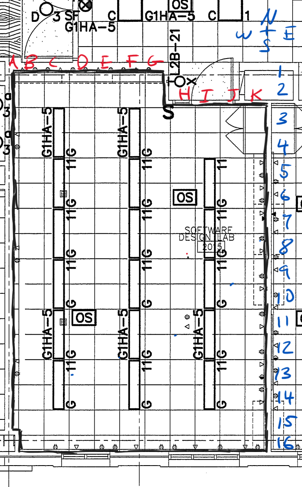
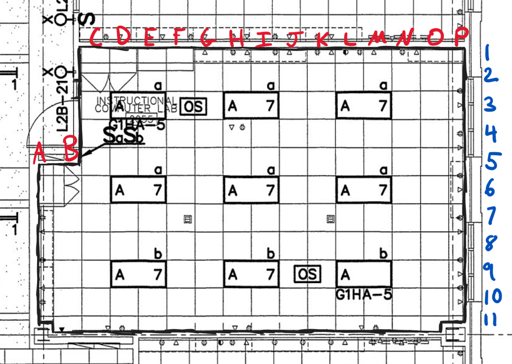

# Zoning Overview

The sensors within a constellation are zoned spatially within a room using a grid system, with each square being a 2x2 ft space.

The first character is a capital letter from *A-Z*, representing each unit of 2 ft length starting **west** and going **east**.

The second character is a number, starting with *1*, representing each unit of 2 ft length starting north and going south.

* *Ex. C5*

Elevation can be loosely indicated by F (within 6-inches of the floor) or C (within 6-inches of the ceiling).

* *Ex. C5C*

## Special Zones

Special Zone are not indicated by zone code, but are instead written plainly. These can be paired with a regular zone to give an approximate idea of where it is located.

* *Ex. Front Door*
* *Ex. Window N3*
* *Ex. Vent L5C*

## Zoning Diagram

### Rayzor 2015

### Rayzor 2055

