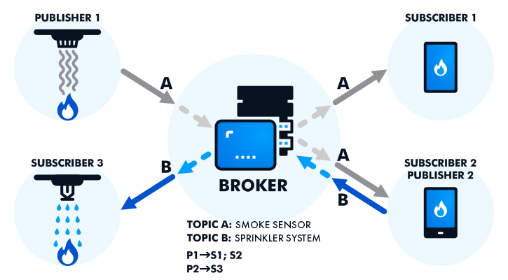

# MQTT Overview

Currently, the sensor network is governed by the protocol **MQTT** (Message Query Telemetry Transport), which is a publish-subscribe model that allows all readings to be sorted into topics by a central computer called a **Broker**.

the MQTT protocol is currently being used to hook all of the Arduino sensors to a central computer through a wireless network, where the central computer will take in that data, as well as send commands back to the sensors.



Each reading is **published** to the Broker device on these **topics**, which are used to label and categorizes the readings. Then, anyone who is connected to this Broker can **subscribe** to one or more of these topics and get all of the readings being published on that topic.

These topics can be further divided into layers of **subtopics**, which can allow for better organization.

---

For the current sensor network setup, each Arduino publishes all of its readings as one large message to the MQTT Aggregator on the *readings* topic, with the subtopic being its manually-set **device name**. For example, a device with the name `A0A0` may publish a reading on:

```
readings/A0A0
```

With *readings* being the main topic and the *device name* as the subtopic.


## MQTT Traffic

The traffic being sent through the MQTT server fall into just a few categories, which are differentiated by the main topic of each message.

* `readings` -> A list of the information obtained from the sensors on a given Sensor Hub, formatted as a JSON string.
* `data` -> Additional information from a given Sensor Hub, such as the configuration settings on the device. This information is not standardized in a particular format, and are often used simply for reference and debugging.
* `commands` -> Commands sent to the server to a given Sensor Hub or collection of Sensor Hubs.

## Readings Format

Currently, while we have many devices *publishing* to the Broker, the Data Manager server is one of the few devices that are *subscribed* to the incoming readings. The Data Manager then stores, processes, and sends the data to Knowledge Core for further processing and policy analysis.

The Data Manager is currently running on the same device that is hosting the MQTT instance, but it can also be ran on anything that is running on the same network as the MQTT protocol.

### MQTT format

When sent from the Arduino devices, the readings are published on the topic `readings/<Device ID>` formatted as such:

```
{
  "readings": [
    {
      "reading_type": "temperature",
      "reading_unit": "celsius",
      "reading_val": "32.55"
    }
  ]
}
```

With:

- The **Reading Type** describing what the reading is measuring,
- The **Reading Unit** describing what units the reading is in, and
- The **Reading Value** being the actual value read.

Here, the `"readings"` attribute is an array, which can hold multiple readings at once. Only one is shown for brevity.

### Knowledge Core Format

When received through MQTT and processed by the Data Manager, the readings are formatted for Knowledge Core as such:

```json
{
	'device_reports': {
		'Zone-2015': {
			'readings': [
				{
					'reading_type': 'temperature',
					'reading_unit': 'celsius',
					'reading_val_type': 'number',
					'reading_val': 30.71,
					'reading_time': '2023-07-24T08:16:02.895598-0500',
					'hardware_info': {
						'sensor_id': 'A0A0', 
						'sensor_device': 'Arduino MKR 1010'
					}
				}
			]
		}
	}
}

```

With:

- The **zone** being the parameter tied to the readings object,
- The **Reading Type** describing what the reading is measuring,
- The **Reading Unit** describing what units the reading is in,
- The **Reading Value Type** describing what data type the reading is sent as,
- The **Reading Value** being the actual value read,
- The **Reading Time** being the time the aggregator gets the data, and
- The **Hardware Information** containing both:
  - The **Device Name** described earlier, and
  - The **Sensor Device** being the model of the Sensor Hub we are using.

Like before, the `readings` attribute can hold multiple readings at once, but only one is shown for brevity.

Again, this is managed primarily by the Data Manager Flask server, but is documented here for ease of access.

## Server Connection

The method of connecting to a given MQTT server is very simple and universal, no matter how you are interfacing with it (Python, Arduino, Unity).

To test a connection to the MQTT server, we would recommend using a program called *MQTT Explorer*, which allows you to monitor the traffic on the server.

To set up a connection with the server with *MQTT Explorer*, or any other interface you need the wireless network, the Broker IP, and the port that the server is running on. As of 12/12/23, the information for the Rayzor building is as follows:

* **Wireless Network:** TU-Research
* **IP:** 192.168.244.42
* **Port:** 1883

The MQTT server requires a username and password to connect, multiple of which have been generated for the different teams and connection methods. Please contact either *Elijah Roberson* or *Dr. Peter Hawrylak* for the credentials required to connect to the server.
